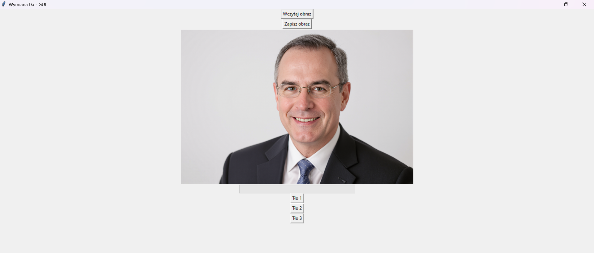

# Background Replacement App

This project is a GUI application for background replacement in images. It uses OpenCV for image processing, Tkinter for the GUI, and a pre-trained image segmentation model from the `transformers` library to generate masks for background replacement.

## Features

- Load an image and replace its background with a new one.
- Use a pre-trained image segmentation model to generate masks.
- Simple and intuitive GUI built with Tkinter.

## Setup Instructions

1. **Clone the repository:**
    ```sh
    git clone https://github.com/yourusername/BackgroundReplacementApp.git
    cd BackgroundReplacementApp
    ```

2. **Create a virtual environment and activate it:**
    ```sh
    python -m venv venv
    .\venv\Scripts\activate  # On Windows
    source venv/bin/activate  # On macOS/Linux
    ```

3. **Install the required dependencies:**
    ```sh
    pip install -r requirements.txt
    ```

4. **Run the application:**
    ```sh
    python main.py
    ```

The Application GUI looks like that:


Click on the "Wczytaj obraz" to read image that you want to replace background in.



If the image is properly read it will display on the screen.
Choose background to put from "Tło 1", "Tło 2", "Tło 3".


Save the new image in the directory you choose by clicking "Zapisz wynik".